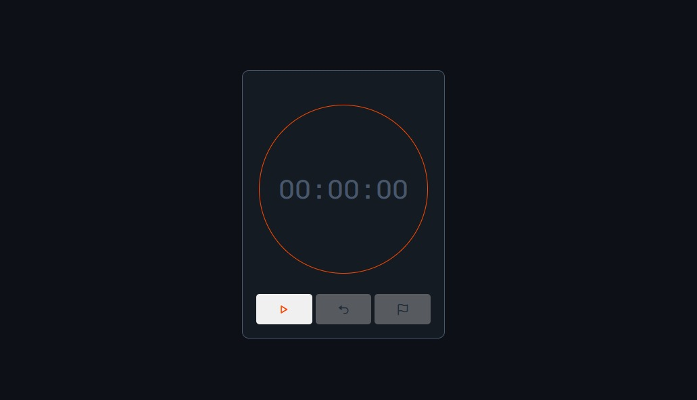

# ⏱️ Cronômetro em JavaScript

Projeto de um **cronômetro digital interativo**, desenvolvido com **HTML, CSS e JavaScript puro**, com foco em lógica de programação, manipulação do DOM e controle de tempo utilizando `setInterval`.

---

## 🚀 Demonstração

O projeto consiste em um cronômetro funcional que permite ao usuário:

- Iniciar e pausar a contagem do tempo  
- Zerar o cronômetro  
- Registrar marcações de tempo (*laps*)  
- Visualizar o tempo no formato **HH:MM:SS**  

A interface conta com controle de visibilidade dos botões, garantindo uma experiência de uso mais intuitiva.

### Principais Funcionalidades

- ▶️ **Iniciar:** começa a contagem do tempo
- ⏸️ **Pausar:** interrompe a contagem
- ↩️ **Resetar:** zera o tempo e as marcações
- 🏴 **Marcações:** registra o tempo atual sem parar o cronômetro
- 👁️ **Controle de UI:** alternância dinâmica dos botões

---

## 🛠️ Tecnologias Utilizadas

- **HTML5**
  - Estrutura semântica da aplicação
- **CSS3**
  - Estilização da interface
  - Organização de classes com metodologia BEM
- **JavaScript (Vanilla JS)**
  - Manipulação do DOM
  - Controle de tempo com `setInterval`
  - Gerenciamento de estado do cronômetro

---

## 📂 Como visualizar o projeto

Este é um projeto frontend simples e pode ser executado localmente:

1. Faça o download ou clone este repositório
2. Certifique-se de que todos os arquivos estão na mesma pasta
3. Abra o arquivo `index.html` em qualquer navegador moderno

> 💡 **Dica:** No VS Code, utilize a extensão **Live Server** para visualizar o projeto com recarregamento automático.

---

## 📘 Documentação Técnica

A documentação completa do funcionamento do cronômetro está disponível no arquivo:

📄 **[Documentação do Cronômetro](./docs/cronometro.md)**

Nela você encontrará:
- Explicação das variáveis
- Funcionamento das funções
- Fluxo de eventos
- Lógica de controle do tempo

---

## 📈 Metas de Aprendizado (Nível Iniciante)

Este projeto foi desenvolvido com foco em praticar:

- Manipulação do DOM com JavaScript
- Uso de `setInterval` e `clearInterval`
- Controle de estado da aplicação
- Organização de código em funções
- Integração entre JavaScript e CSS
- Boas práticas de legibilidade e manutenção

---

## 📫 Contato

- **LinkedIn:** [Filipe Monteiro](https://www.linkedin.com/in/filipe-monteiro-208b8b326/)
- **E-mail:** contato@filipemonteiro.com

---

⭐️ **Se este projeto te ajudou de alguma forma, considere deixar uma star no repositório!**
