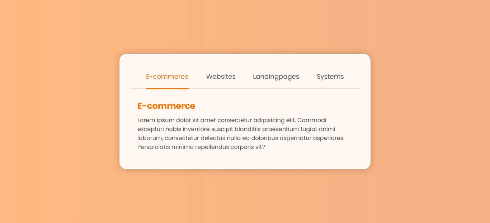

# 📌 Menu Tabs com Underline Animado
Esse projeto consiste em criar um menu que altera o conteúdo principal
através do clique nos links da barra de navegação.



Projeto de um menu de navegação em formato **Tabs**, com:

-   Alteração dinâmica de conteúdo
-   Controle de estado ativo
-   Animação de underline deslizante
-   Implementação utilizando apenas **HTML, CSS e JavaScript puro
    (Vanilla JS)**


# 📂 Estrutura do Projeto

## 🔹 Estrutura HTML

A aplicação é dividida em três blocos principais:

-   `.container` → Wrapper principal da aplicação
-   `header` → Contém:
    -   Lista de links (`.link`)
    -   Elemento `.line`, responsável pelo underline animado
-   `.content` → Container dos conteúdos (`.content_item`) que são
    exibidos dinamicamente

Estrutura lógica:

    .container
     ├── header
     │    ├── .link
     │    ├── .link
     │    └── .line
     └── .content
          ├── .content_item
          ├── .content_item
          └── .content_item


## ⚙️ Lógica JavaScript

A lógica é baseada em **manipulação de DOM** e **controle de classes
CSS**.

### 1️⃣ Seleção dos links
---

Primeiro selecionamos todos os links do menu:

``` js
const links = document.querySelectorAll(".link");
```

Em seguida, percorremos a NodeList utilizando `forEach`, obtendo:

-   `element` → O elemento atual
-   `index` → A posição do elemento no array

``` js
links.forEach((element, index) => {

});
```
### 2️⃣ Adicionando o evento de clique
---

Para cada link, adicionamos um `addEventListener("click", (e) => {})` . Isso faz com que quando click acontece, a função é executada e o navegador passa automaticamente o objeto do evento como argumento da função.:

``` js
links.forEach((element, index) => {
  element.addEventListener("click", (e) => {

  });
});
```

O `e` é o **objeto do evento**

Sempre que um evento é disparado, o navegador cria automaticamente um objeto com todas as informações sobre aquele evento e passa esse evento como argumento para função

poderia ser chamado de qualquer nome, mas convencionalmente chamamos de `e` ou `event` .

### 3️⃣ Animação do underline
------------------------------------------------------------------------

O underline (`.line`) deve:

-   Ajustar sua largura (`width`)
-   Ajustar sua posição horizontal (`left`)

Esses valores são obtidos a partir do link clicado:

-   `offsetWidth` → Largura do elemento
-   `offsetLeft` → Distância da esquerda

``` js
const line = document.querySelector(".line");

line.style.width = e.target.offsetWidth + "px";
line.style.left = e.target.offsetLeft + "px";
```

Dentro do objeto do evento `e` , existe a propriedade `target` que representa o elemento que foi clicado.

A partir desse elemento, conseguimos pegar sua largura e posicionamento usando o `offsetWidth` e o `offsetLeft` e passar isso para o underline (`line`).

Em casos onde o link possui elementos filhos, pode ser mais seguro utilizar `e.currentTarget`, pois ele sempre representa o elemento que recebeu o `addEventListener`.

### 4️⃣ Controle da classe `.active`
------------------------------------------------------------------------
Antes de ativar o link clicado, removemos `.active` de todos:

``` js
links.forEach(link => {
  link.classList.remove("active");
});
```

Depois adicionamos ao elemento clicado:

``` js
element.classList.add("active");
```

Isso garante que apenas um link fique ativo por vez.

### 5️⃣ Controle de exibição do conteúdo
------------------------------------------------------------------------
Selecionamos todos os conteúdos:

``` js
const contents = document.querySelectorAll(".content_item");
```

Removemos a classe `.show` de todos:

``` js
contents.forEach(content => {
  content.classList.remove("show");
});
```

E então ativamos apenas o conteúdo correspondente ao índice do link
clicado:

``` js
contents[index].classList.add("show");
```

A correspondência funciona porque:

-   A ordem dos `.link`
-   É a mesma ordem dos `.content_item`

### 🧠 Código Final Consolidado
---

``` js
const links = document.querySelectorAll(".link");
const contents = document.querySelectorAll(".content_item");
const line = document.querySelector(".line");

links.forEach((element, index) => {
  element.addEventListener("click", () => {

    // Atualiza underline
    line.style.width = element.offsetWidth + "px";
    line.style.left = element.offsetLeft + "px";

    // Remove active de todos
    links.forEach(link => link.classList.remove("active"));

    // Ativa link atual
    element.classList.add("active");

    // Esconde todos os conteúdos
    contents.forEach(content => content.classList.remove("show"));

    // Mostra conteúdo correspondente
    contents[index].classList.add("show");
  });
});
```
### 🎯 Conceitos Trabalhados

-   `querySelectorAll`
-   `forEach`
-   `addEventListener`
-   Manipulação de classes com `classList`
-   Manipulação de estilo inline
-   Propriedades `offsetWidth` e `offsetLeft`
-   Sincronização entre elementos via `index`

## 🔎 CSS no Comportamento das Tabs

Neste projeto, o CSS é o responsável direto pela **resposta visual às
interações do usuário**.

O JavaScript apenas altera classes e propriedades --- quem executa o
comportamento visual é o CSS.

### 1️⃣ Comportamento dos Links (`.link` + `.active`)

``` css
.link {
    color: #535353;
    font-size: 18px;
    font-weight: 400;
}

.active {
    color: #ff7300;
}
```

#### 🎯 Papel estrutural

-   `.link` define o estado base (inativo).
-   `.active` representa o estado selecionado.
-   A mudança de cor comunica visualmente qual aba está ativa.

#### 🔎 Importância arquitetural

O CSS implementa um **modelo de estados visuais**:

    Estado padrão → .link
    Estado ativo  → .link.active

O JavaScript não altera estilo diretamente --- ele apenas adiciona ou
remove `.active`.

Isso mantém:

-   Separação de responsabilidades
-   Código mais escalável
-   Fácil manutenção

### 2️⃣ Comportamento da Linha Animada (`.line`)
---

``` css
.container header nav ul {
    position: relative;
}

.line {
    position: absolute;
    height: 3px;
    background-color: #ff7300;
    bottom: -1.5px;
    left: 44px;
    transition: all .3s ease;
}
```

#### 🎯 Papel técnico

 🔹 `position: relative` no `ul`

Cria o **contexto de posicionamento** para a `.line`.

Sem isso, o `left` da `.line` seria relativo ao `body`.

🔹 `position: absolute` na `.line`

Permite que o JavaScript controle:

``` js
line.style.width
line.style.left
```

Ou seja:

-   `width` → largura do link ativo
-   `left` → posição horizontal do link ativo

##### 🔹 `transition: all .3s ease`

Esse é o ponto crítico.

Sem essa linha, a `.line` simplesmente "pularia" para o novo local.

Com a transição:

-   A mudança de `width`
-   A mudança de `left`

São animadas suavemente.

🔎 **Conclusão importante:**

O JavaScript move a linha.

O CSS é quem cria a animação.

### 3️⃣ Comportamento dos Conteúdos (`.content_item` + `.show`)
---
``` css
.content_item {
   display: none;
   animation: moving .5s ease;
}

.show {
    display: block;
}
```
#### 🎯 Sistema de visibilidade

Todos os conteúdos começam ocultos:

    display: none

Quando recebem `.show`:

    display: block

Isso cria um sistema de alternância baseado em estado:

    Invisível → Visível

O JavaScript apenas controla qual elemento recebe `.show`.

### 4️⃣ Animação de Transição de Conteúdo
---
``` css
@keyframes moving {
    from {
        transform: translateX(50px);
        opacity: 0;
    }
    to {
        transform: translateX(0px);
        opacity: 1;
    }
}
```

#### 🎯 Por que isso é importante?

Quando um `.content_item` se torna visível:

-   Ele desliza da direita para a posição original
-   A opacidade vai de 0 → 1

Isso evita troca brusca de conteúdo.

#### 🔎 Detalhe técnico relevante

A animação usa:

-   `transform`
-   `opacity`

Essas propriedades são mais performáticas porque:

-   Não forçam reflow pesado
-   São aceleradas por GPU

Resultado:

Transição fluida e com boa performance.

------------------------------------------------------------------------

### 📌 Resumo Estrutural

O comportamento do sistema depende de três mecanismos CSS:

#### 🔹 1. Classe de estado (`.active`)

Define qual link está selecionado.

#### 🔹 2. Posicionamento + transição (`.line`)

Cria o underline animado.

#### 🔹 3. Alternância de visibilidade + keyframe (`.content_item`)

Controla a exibição e animação do conteúdo.

### 🎯 Conclusão Técnica

Neste projeto:

-   O JavaScript controla **estado**
-   O CSS controla **comportamento visual**

Sem:

-   `transition`
-   `position: relative`
-   `display: none`
-   `@keyframes`

O sistema não funcionaria visualmente como Tabs.
